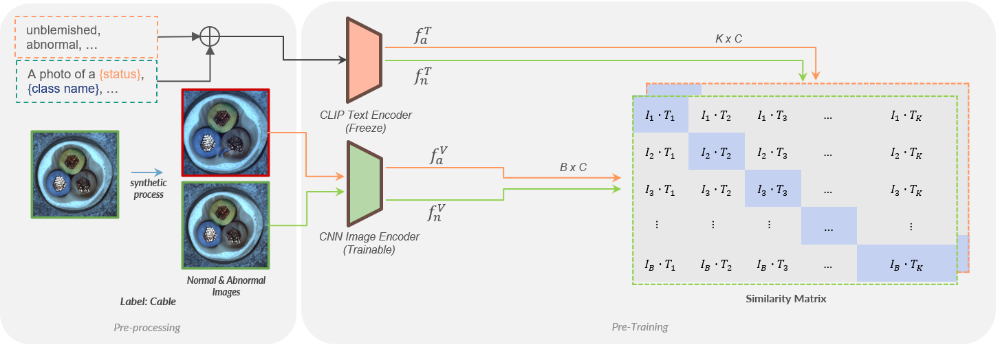
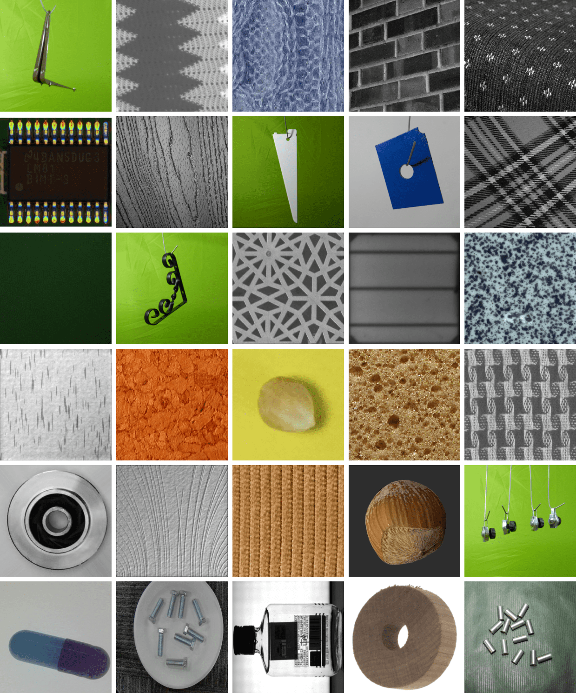

# TAB: Text-Align Anomaly Backbone Model for Industrial Inspection Tasks

  <p align="center">
      
<!--       <a href='https://github.com/howeng98/TAB'></a>
      <a href="https://hits.seeyoufarm.com"></a>
      <a href="https://hits.sh/drive.google.com/drive/folders/1T-SRSi5D_dyvJ-HqAEtiHGYdiWfJ6_q8/"></a>
     -->
  </p>

  <p align="center">
    
  </p>

  
  ### Installation:
  ```
  git clone git@github.com:Howeng98/TAB.git
  cd TAB
  conda create -n TAB
  conda activate TAB
  pip install -r requirements.txt
  ```
  
  ### Pre-training
  You can kindly modify the pre-training dataset, backbone structure, and hyperparameters in the config.py 
  ```
  python main.py
  ```

## Anomaly Backbone Checkpoint Download  
  |   Description  | Weights Download |
  | :------------: | :--------------: |
  | MVTecAD ResNet18 | [Download Link](https://drive.google.com/drive/folders/1T-SRSi5D_dyvJ-HqAEtiHGYdiWfJ6_q8?usp=sharing) |
  | IndustrialDataset ResNet18 | [Download Link](https://drive.google.com/drive/folders/1knOHNj5U5Ya6qRjhD3hUo-K4F_BTg0YS?usp=sharing) |


## Industrial Dataset
We propose a well-organized dataset for industrial visual inspection named Industrial Dataset. This dataset was constructed by selectively aggregating open-source
datasets from global websites and official public conference workshops as references. The Industrial Dataset encompasses 30 categories, including 15
object categories and 15 texture categories, amounting to a total of 17,393 images. Notably, the Industrial dataset exclusively comprises normal images.
<p align="center">
  
</p>

  ### Dataset Structure
  ```clike=
    Industrial Dataset
    ├─ Washer
    │  ├─ 0001.png
    │  ├─ 0002.png
    │  ...
    │  └─ 3241.png
    │  
    ├─ Metal Tube
    │  ├─ 001.png
    │  ├─ 002.png
    │  ...
    │  └─ 122.png
    ├─ Hazelnut
    ...
  ```

  ### Dataset Sources
  Idx | Class Name | Number of normal samples  | Source | Note
  :-- | :--| :--| :--| :--|
  1 | Bent Metal Stripe   | 185 | [link](https://ieeexplore.ieee.org/abstract/document/9631567) | MPDD |
  2 | Board | 40 | [link](https://hci.iwr.uni-heidelberg.de/content/weakly-supervised-learning-industrial-optical-inspection) | DAGM |
  3 | Bolt | 128 | [link](https://ieeexplore.ieee.org/abstract/document/9631567) | MPDD |
  4 | Bottle | 746 | [link](https://tianchi.aliyun.com/dataset/110147) |  |
  5 | Brick Tile | 80 | [link](https://www.researchgate.net/figure/All-25-classes-of-UIUC-dataset_fig7_313466694) | UIUC |
  6 | Capsule | 749 | [link](https://github.com/TSjianjiao/Defect-Detection-with-tensorflow) |  |
  7 | Chip | 1211 | [link](https://www.kaggle.com/datasets/kubeedgeianvs/pcb-aoi) | PCB-AoI Public |
  8 | Cork | 216 | [link](https://pan.baidu.com/s/173h8V66yRmtVo5rc2P7J4A#list/path=%2Fsharelink623692574-25785) | KTH-TIPS2 |
  9 | Encapsulates Carpet | 728 | [link](https://ieeexplore.ieee.org/abstract/document/9631567) | - |
  10 | Hazelnut | 50 | [link](https://adfi.jp/download/) | ADFI |
  11 | Hazelnut Toy | 34 | [link](https://openvinotoolkit.github.io/anomalib/data/hazelnut_toy.html) |  |
  12 | Jagged Carpet | 80 | [link](https://user.it.uu.se/~gusky180/texture/) | Kylberg |
  13 | Leather | 600 | [link](https://www.kaggle.com/datasets/praveen2084/leather-defect-classification) | Leather Defect Cls |
  14 | Metal Flat | 54 | [link](https://ieeexplore.ieee.org/abstract/document/9631567) | MPDD |
  15 | Metal ornament | 289 | [link](https://ieeexplore.ieee.org/abstract/document/9631567) | MPDD |
  16 | Metal Pole| 110 | [link](https://ieeexplore.ieee.org/abstract/document/9631567) | MPDD |
  17 | Metal Tube | 122 | [link](https://ieeexplore.ieee.org/abstract/document/9631567) | MPDD |
  18 | Plaid | 20 | [link](https://www.researchgate.net/figure/All-25-classes-of-UIUC-dataset_fig7_313466694) | UIUC |
  19 | Rhombus Carpet | 80 | [link](https://user.it.uu.se/~gusky180/texture/) | Kylberg |
  20 | Screw | 59 | [link](https://ieeexplore.ieee.org/abstract/document/9631567) | - |
  21 | Solar Board | 2624 | [link](https://github.com/zae-bayern/elpv-dataset) | ELPV |
  22 | Sponge | 40 | [link](https://pan.baidu.com/s/173h8V66yRmtVo5rc2P7J4A#list/path=%2Fsharelink623692574-25785) | KTH-TIPS2 |
  23 | Streak Board | 1041 | [link](https://hci.iwr.uni-heidelberg.de/content/weakly-supervised-learning-industrial-optical-inspection) | DAGM |
  24 | Stripe Carpet | 336 | [link](https://user.it.uu.se/~gusky180/texture/) | Kylberg |
  25 | Stripe Wood | 1000 | [link](https://hci.iwr.uni-heidelberg.de/content/weakly-supervised-learning-industrial-optical-inspection) | DAGM |
  26 | Tile | 230 | [link](https://ieeexplore.ieee.org/abstract/document/9631567) | - |
  27 | Toy Wheel | 3200 | [link](https://ieeexplore.ieee.org/abstract/document/9631567) | - |
  28 | Upholstery | 20 | [link](https://www.researchgate.net/figure/All-25-classes-of-UIUC-dataset_fig7_313466694) | UIUC |
  29 | Washer | 3241 | [link](https://www.kaggle.com/datasets/ravirajsinh45/real-life-industrial-dataset-of-casting-produc) |  |
  30 | Wave Carpet | 80 | [link](https://user.it.uu.se/~gusky180/texture/) | Kylberg |

  
  ### NTHU CVLAB
  For more details, please visit [CVLAB](https://cv.cs.nthu.edu.tw/).
  
  ### License
  MIT Licence

  ### References
  - [MPDD](https://ieeexplore.ieee.org/abstract/document/9631567)
  - [Capsule](https://github.com/TSjianjiao/Defect-Detection-with-tensorflow)
  - [PCB-AoI Public](https://www.kaggle.com/datasets/kubeedgeianvs/pcb-aoi)
  - [Alcohol Bottle](https://tianchi.aliyun.com/dataset/110147)
  - [Hazelnut](https://adfi.jp/download/)
  - [Hazelnut Toy](https://openvinotoolkit.github.io/anomalib/data/hazelnut_toy.html)
  - [ELPV](https://github.com/zae-bayern/elpv-dataset)
  - [DAGM](https://hci.iwr.uni-heidelberg.de/content/weakly-supervised-learning-industrial-optical-inspection)
  - [Kylberg](https://user.it.uu.se/~gusky180/texture/)
  - [KTH-TIPS2](https://pan.baidu.com/s/173h8V66yRmtVo5rc2P7J4A#list/path=%2Fsharelink623692574-25785)
  - [UIUC](https://www.researchgate.net/figure/All-25-classes-of-UIUC-dataset_fig7_313466694)
  - [Leather Defect Classification](https://www.kaggle.com/datasets/praveen2084/leather-defect-classification)

### Citation
If you found TAB useful in your research or applications, please kindly cite using the following BibTeX:
```
@misc{lee2023tab,
      title={TAB: Text-Align Anomaly Backbone Model for Industrial Inspection Tasks}, 
      author={Ho-Weng Lee and Shang-Hong Lai},
      year={2023},
      eprint={2312.09480},
      archivePrefix={arXiv},
      primaryClass={cs.CV}
}
```
